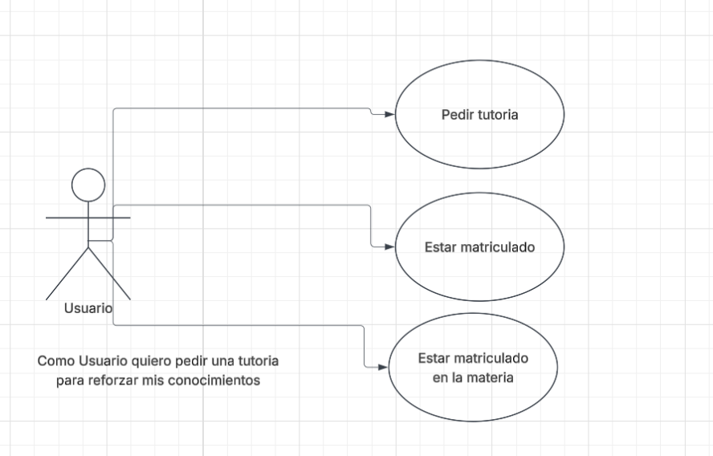
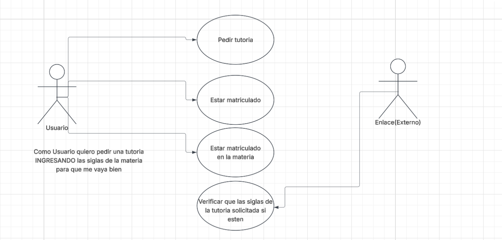

# Requerimientos del Sistema

## 1. Lista General de Requerimientos

El sistema TutoECI tiene los siguientes requerimientos:

### 1.1 Requerimientos Funcionales

El sistema TutoECI debe tener la cpacidad de:

1. Validar las materias del estudiante que solicita la tutoria mediante el ID del estudiante
2. Solo puede permitir reservar si la sigla de la materia esta en el formato devuelto por enlace (en formato JSON)
3. Solo puede permitir dar tutorias a profesores y estudiantes de posgrados

### 1.2 Requerimientos no Funcionales

El Sistema TutoECI debe tener:

1. El diseño debe tener los colores del programa Ingenieria de sistemas(color verde)
2. La interfaz se debe adaptar al escritorio y a dispositivos moviles

## 2. Diagramas de caso de uso

### 2.1 Requerimiento Funcional 1

| Campo | Descripción |
|------|-------------|
| **ID** | RF-01 |
| **Nombre del requerimiento** |Validar la materia que en la que pide tutoria |
| **Descripción** | *El sistemas debe permitir que el estudiante pida una tutoria* |
| **Precondiciones** | *El estudiante debe estar matriculado y debe estar viendo la materia en la que pide tutoria* |
| **Actor** | *Usuario* |
| **Flujo principal** | 1. El usuario pide una tutoria.  2. El sistema valida que este matriculado en la U  3. Estar matriculado en la materia |
| **Diagrama de caso de uso** | **|
| **Poscondiciones** | *El estudiante pide la tutoria* |

### 2.2 Requerimiento Funcional 2

| Campo | Descripción |
|------|-------------|
| **ID** | RF-02 |
| **Nombre del requerimiento** |Validar las siglas de la materia |
| **Descripción** | *El sistemas debe permitir que el estudiante pida una tutoria siempre y cuando las siglas de la materia esten en enlace* |
| **Precondiciones** | *El estudiante debe estar matriculado y debe estar viendo la materia en la que pide tutoria y se verifica mediante las siglas* |
| **Actor** | *Usuario y actor externo(enlace)* |
| **Flujo principal** | 1. El usuario pide una tutoria.  2. El sistema valida que este matriculado  3. El sistema enlace verifica que si este matriculado en la materia por las siglas |
| **Diagrama de caso de uso** | **|
| **Poscondiciones** | *El estudiante queda inscrito a la tutoria* |

### 2.1 Requerimiento Funcional 3

| Campo | Descripción |
|------|-------------|
| **ID** | RF-03 |
| **Nombre del requerimiento** |Validar que solo la tutoria la da un profesor o estudiante de posgrado |
| **Descripción** | *El sistemas solo debe permitir que un profesor o estudiante de posgrado de tutorias* |
| **Precondiciones** | *Debe ser profesor de la materia o estudiante de posgrado* |
| **Actor** | *profesor y estudiante de posgrado* |
| **Flujo principal** | 1. porfesor o estudiante de posgrado dan tutoria.  2. El sistema valida que sea profesor o estudiante de pogrado |
| **Poscondiciones** | *solo profesores y estudiante de posgrado dan tutoria* |